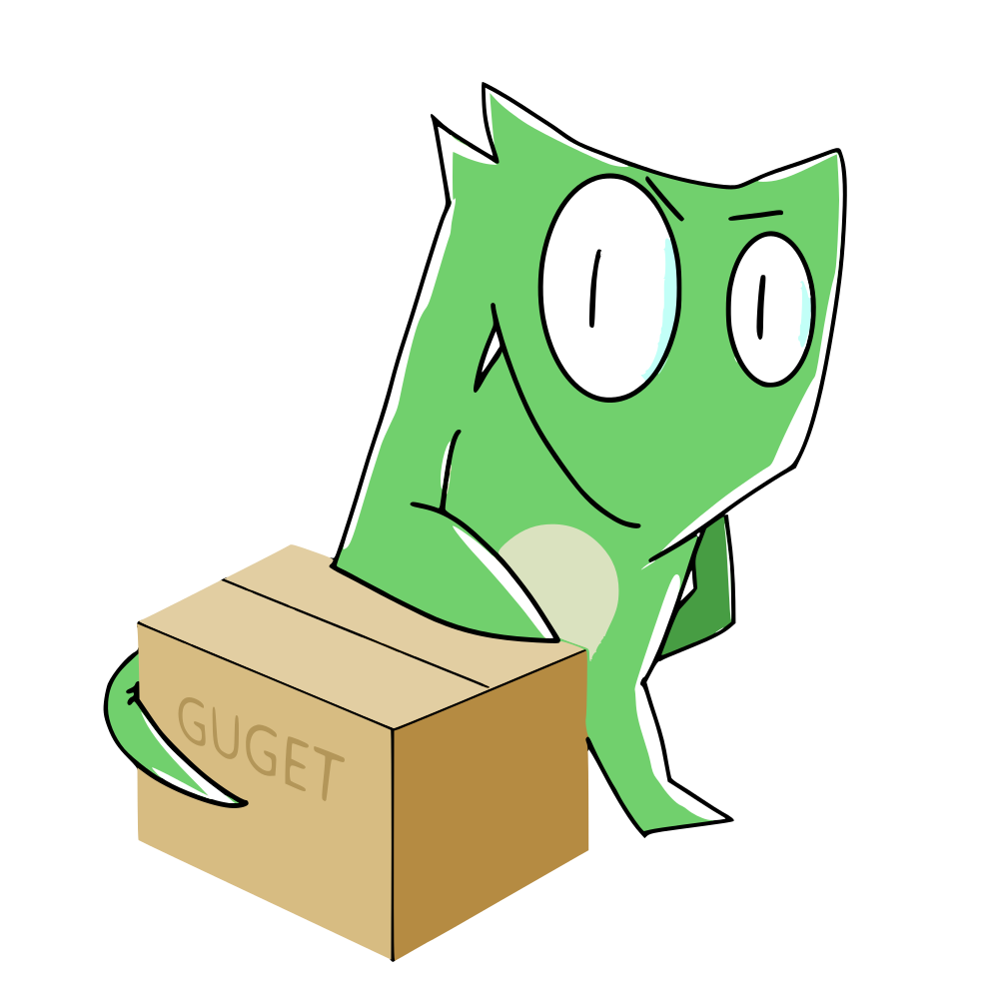
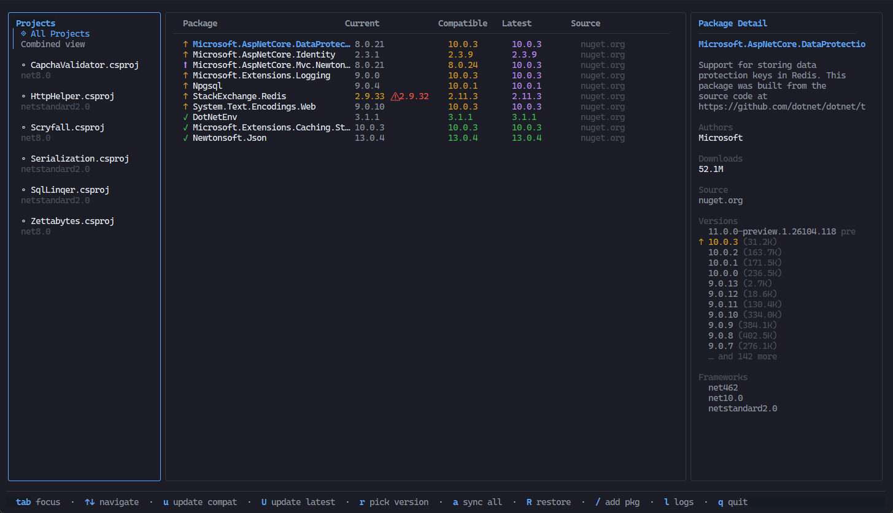

<div align="center">

# guget




[]()
[](https://github.com/nulifyer/guget/releases)
[](https://marketplace.visualstudio.com/items?itemName=nulifyer.guget)

A terminal UI for managing NuGet packages across .NET projects.
</div>

## Overview

`guget` lets you browse, update, and add NuGet packages across all `.csproj` and `.fsproj` files in a directory — without leaving the terminal. It fetches live version data from your configured NuGet sources and shows you at a glance what's out of date.

<div align="center">



</div>

---

## Features

| | Feature | Description |
|:-:|---------|-------------|
| 📁 | **Browse projects** | Scans recursively for `.csproj` / `.fsproj` files, with support for Central Package Management (`Directory.Build.props`) and imported `.props` files |
| 🚀 | **Live version status** | Fetches latest versions from NuGet v3 API |
| 🛡️ | **Vulnerability & deprecation tracking** | Surfaces CVE advisories and deprecated status per package version, with severity-coloured indicators in the list, detail panel, and version picker. Packages from private/Azure feeds are automatically enriched with vulnerability data from nuget.org |
| ⬆️ | **Update packages** | Bump to the latest compatible or latest stable version |
| 📋 | **Version picker** | Choose any specific version with target-framework and vulnerability indicators |
| 🌳 | **Dependency tree** | `t` shows declared dependencies; `T` runs `dotnet list --include-transitive` for the full transitive tree with status icons |
| ➕ | **Add packages** | Search NuGet and add new package references |
| 🔄 | **Bulk operations** | Update a package across all projects at once |
| 🔧 | **Restore** | Run `dotnet restore` without leaving the TUI |
| 🌐 | **Multi-source** | Respects `NuGet.config` and global NuGet source configuration. Private feed packages are supplemented with metadata from nuget.org |
| 🔗 | **Clickable hyperlinks** | Package names, advisory IDs, versions, and source URLs are clickable in terminals that support OSC 8 hyperlinks |
| 🎨 | **Themes** | Built-in colour themes: `auto`, `dracula`, `nord`, `everforest`, `gruvbox`. Select with `--theme` / `-t` |
| ↔️ | **Responsive layout** | Columns hide progressively on narrow terminals to keep the UI usable at any width |
| 📜 | **Log panel** | Real-time internal logs, toggleable with `l` |
| 🔌 | **Sources panel** | View configured NuGet sources, toggleable with `s` |
| ❓ | **Help overlay** | Full keybinding reference, press `?` |

---

## Requirements

To run:
- The [guget](https://github.com/nulifyer/guget) CLI binary
- [.NET SDK](https://dotnet.microsoft.com/download) dotnet CLI

To build:
- [Go](https://go.dev/) 1.25+
- [.NET SDK](https://dotnet.microsoft.com/download) dotnet CLI

---

## Installation

**Linux / macOS**

Installs to `/usr/local/bin` if writable, otherwise `~/.local/bin`. Override the install location with `GUGET_INSTALL=/your/path`.

```bash
curl -fsSL https://raw.githubusercontent.com/nulifyer/guget/main/install.sh | bash
```
```bash
wget -qO- https://raw.githubusercontent.com/nulifyer/guget/main/install.sh | bash
```

**Windows (PowerShell)**

```powershell
irm https://raw.githubusercontent.com/nulifyer/guget/main/install.ps1 | iex
```

Fetches the latest release from GitHub, installs to `%LOCALAPPDATA%\Programs\guget`, and adds it to your user `PATH` automatically. Override the install location with `$env:GUGET_INSTALL`.

> **Windows note:** The binary is not yet code-signed, so Windows SmartScreen may warn on first run. Running from a terminal (PowerShell or cmd) bypasses this.

**Manual download**

Grab the archive for your platform from the [Releases page](https://github.com/nulifyer/guget/releases) and place the binary somewhere on your `PATH`.

**Build from source**

```bash
git clone https://github.com/nulifyer/guget
cd guget/guget
go build -o guget        # Linux / macOS
go build -o guget.exe    # Windows
```

---

## Usage

```
guget [options] [project]

Usage:
    no-color     -nc, --no-color
                Disable colored output in the terminal

    verbosity    -v, --verbose
                Set the logging verbosity level
                [<empty>, none, error, err, warn, warning, info, debug, dbg, trace, trc]

    project      -p, --project
                Set the target project directory (defaults to current working directory)

    theme        -t, --theme
                Color theme
                [auto, dracula, nord, everforest, gruvbox, etc]

    log-file     -lf, --log-file
                Write all log output to this file (in addition to the TUI log panel)

    version      -V, --version
                Print the version and exit
```

**Examples:**

```bash
# Scan the current directory
guget

# Scan a specific solution folder
guget ~/src/MyApp

# Enable verbose logging
guget -v debug

# Use the dracula theme
guget -t dracula
```

---

## Keybindings

### Navigation

| Key | Action |
|-----|--------|
| `Tab` / `Shift+Tab` | Cycle panel focus (Projects → Packages → Detail → Logs) |
| `↑` / `k` | Move up |
| `↓` / `j` | Move down |
| `Enter` | Confirm / move focus from Projects to Packages |
| `Esc` / `q` / `Ctrl+C` | Quit (main screen) / Close (overlay) |

### Package Actions (packages panel)

| Key | Action |
|-----|--------|
| `u` | Update to latest **compatible** version (this project) |
| `U` | Update to latest **compatible** version (all projects) |
| `a` | Update to latest **stable** version (this project) |
| `A` | Update to latest **stable** version (all projects) |
| `v` | Open version picker overlay |
| `o` | Cycle sort mode |
| `O` | Toggle sort direction |
| `d` | Remove selected package (prompts for confirmation) |
| `t` | Show declared dependency tree for the selected package |

### Project Actions

| Key | Action |
|-----|--------|
| `r` | Run `dotnet restore` (selected project) |
| `R` | Run `dotnet restore` (all projects) |
| `T` | Show full transitive dependency tree |
| `/` | Search NuGet and add a new package |

### General

| Key | Action |
|-----|--------|
| `l` | Toggle log panel |
| `s` | Toggle sources panel |
| `?` | Toggle keybinding help |
| `[` / `]` | Resize focused panel |

### Search Overlay (`/`)

| Key | Action |
|-----|--------|
| `↑` / `Ctrl+P` | Previous result |
| `↓` / `Ctrl+N` | Next result |
| `Enter` | Select package |
| `Esc` | Close |

### Version Picker (`v`)

| Key | Action |
|-----|--------|
| `↑` / `k` | Previous version |
| `↓` / `j` | Next version |
| `u` | Apply version (this project) |
| `U` | Apply version (all projects) |
| `Enter` | Apply version |
| `Esc` / `q` | Close |

---

## Package Status Icons

| Icon | Meaning |
|------|---------|
| `▲` | Installed version has known **CVE vulnerabilities** |
| `✗` | Error fetching version info |
| `↑` | Newer **compatible** version available |
| `⬆` | Newer **stable** version available (beyond compatible) |
| `~` | Package is **deprecated** in the registry |
| `✓` | Up to date |

---

## How It Works

1. On startup, `guget` walks the target directory and parses every `.csproj` / `.fsproj` it finds (skipping `bin`, `obj`, `node_modules`, `.git`, etc.).
2. A background goroutine queries your configured NuGet sources for the latest version data for each package.
3. The UI updates as results arrive — no waiting for a full scan before you can start navigating.
4. When you update a package, `guget` rewrites the relevant project file(s) in place.

---

## Built With

- [Bubbletea](https://github.com/charmbracelet/bubbletea) — TUI framework (MVU pattern)
- [Bubbles](https://github.com/charmbracelet/bubbles) — list, spinner, text input, viewport
- [Lipgloss](https://github.com/charmbracelet/lipgloss) — terminal styling and layout
